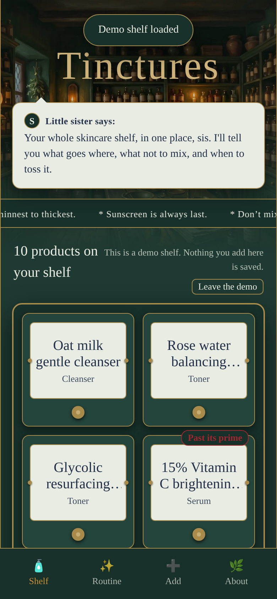
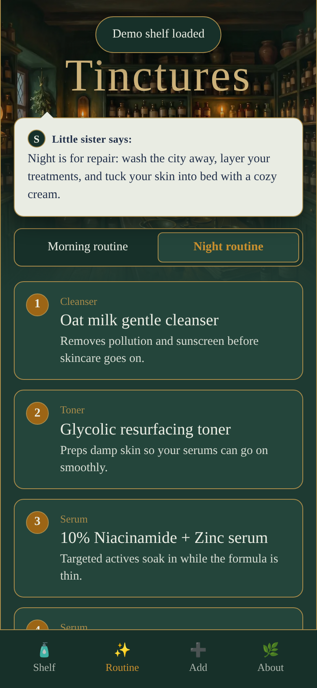
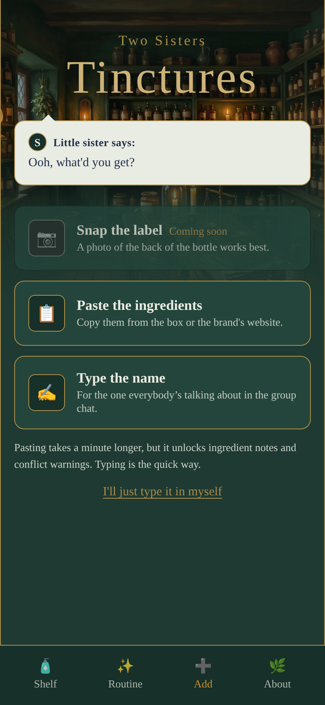
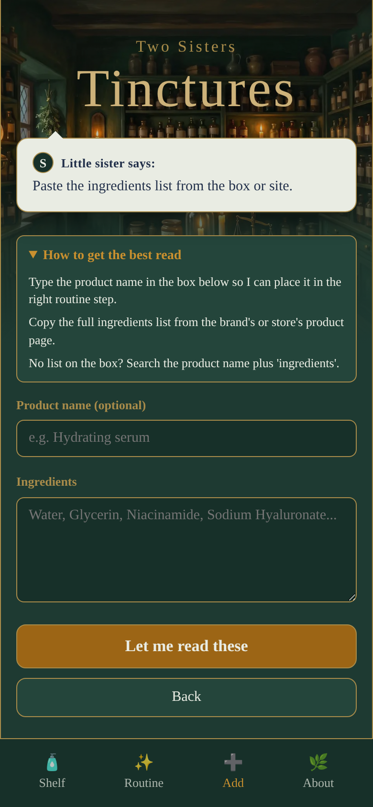
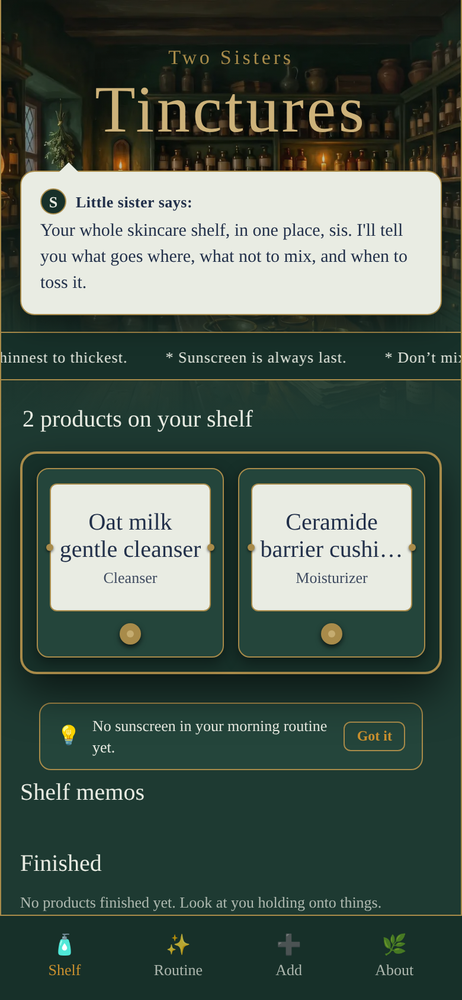

# Two Sisters Tinctures

A skincare shelf tracker I built for my little sister. She adds a product, it becomes a card on her shelf, and the app sorts the shelf into a morning and evening order and flags things that should not be layered.

**Live:** https://two-sisters-tinctures.onrender.com/
**Look around first:** add `?demo=1` to the address for a pre-filled demo shelf (memory only, gone when you close the tab).

Built for the **DEV Hacktoberfest Weekend Challenge: Build for a Friend** (October 2 to 5, 2026).

> AI assisted. Human approved. Powered by NLP.

## Screenshots

Phone-sized views of the demo shelf (`?demo=1`). The products in the demo are invented.

<table>
  <tr>
    <td align="center"><br><sub>The shelf</sub></td>
    <td align="center"><br><sub>Night routine, with a reason for each step</sub></td>
    <td align="center"><br><sub>Add a product (photo is coming soon)</sub></td>
  </tr>
  <tr>
    <td align="center"><br><sub>Paste screen with the best-read tip</sub></td>
    <td align="center"><br><sub>A gap hint on a small shelf</sub></td>
    <td></td>
  </tr>
</table>

## What it does

- **Add a product** by typing its name, or pasting the ingredient list from the back of the bottle. Photo of the label is coming later (the card is greyed out).
- **Gemma 4 reads it** and drafts a card: name, brand, type, a one-line "what it does," and the ingredients.
- **You confirm.** Nothing lands on the shelf until a human taps save.
- **Rules decide the rest.** Morning and evening order, conflict warnings, and ingredient notes come from a plain file, `public/rules.json`, not from the model.
- **Her shelf stays on her phone.** It lives in the browser's `localStorage`. No account, no database.

## Status

| Feature | Status |
|---|---|
| Type a product name | Works |
| Paste ingredients | Works |
| Photo of the label | Not built. The card is greyed out with "Coming soon," and the server returns 501 `photo_not_ready` |
| Lookup (web search, product page URL, barcode) | Not built. Tested by hand only, recorded as stubs in `PRD.md` and `FINDINGS.md` |
| Gap hints ("No sunscreen in your morning routine yet.") | Works |
| "How to get the best read" tip on the Paste screen | Works |
| Shelf, order, conflicts, ingredient notes | Works |
| Model down or slow | Works, app says so and offers manual add |
| Gemini API path | Tested |
| Ollama (local model) path | Stub, not tested |
| Allergy checks | Not built. Not medical advice |

## Architecture

```
Browser (vanilla JS, no framework)
  shelf-store.js        shelf in localStorage (tst:shelf:v1)
  rules.json            order, conflicts, ingredient notes (deterministic)
  read-client.js        calls /api/read, 35 s client timeout
  app.js                screens and wiring
        |
        |  POST /api/read   (same-origin only)
        v
Node service (server/)
  index.js              static files, /healthz, /api/read, security headers
  limits.js             per-minute, per-visitor, and total daily caps
  gemma.js              builds the prompt, calls Gemini API, unwraps the answer
  validate.js           checks the model's answer before the app trusts it
        |
        v
Gemma 4 (gemma-4-26b-a4b-it) via the Gemini API
```

**The one design rule:** the model reads, the rules decide. Gemma answers one question, "what is this product?" Everything after that (order, conflicts, warnings) comes from `rules.json`. Structure is deterministic. Flavor, meaning the one-line description, is the model's.

**What `validate.js` does with every model answer:**

- rejects anything that is not the expected shape, and logs only a reason code
- trims names, brands, and descriptions that run too long
- drops any ingredient that does not appear word for word in the pasted text
- replaces a description that mentions an ingredient the product does not list
- forces an empty ingredient list for typed names (the model must not invent one)

**Protection for a public link with a paid key:**

- 50 reads a day for the whole app, 10 a day per visitor, and a per-minute limit
- same-origin check on the API route
- Gemini key lives only in the server environment, restricted to the Gemini API
- a budget alert sits behind all of it
- security headers: CSP (`script-src 'self'`), HSTS, nosniff, frame-ancestors none
- the browser only uses `textContent`, never `innerHTML`, and ESLint enforces it

**Known limit:** the per-visitor cap keys off the visitor's IP, and a forged `X-Forwarded-For` header can dodge it. The total daily cap and the budget alert are the real backstops. Details in `FINDINGS.md`.

## Run it locally

Needs Node 24 (see `.node-version`) and a Gemini API key.

```bash
git clone https://github.com/earlgreyhot1701D/two-sisters-tinctures.git
cd two-sisters-tinctures
npm ci
cp .env.example .env     # then put your key in .env
npm start                # http://localhost:3000
```

Never commit `.env`. The key stays server-side.

### Environment variables

| Variable | Default | What it does |
|---|---|---|
| `GEMINI_API_KEY` | none | Your Gemini API key (required for reads) |
| `MODEL_PROVIDER` | `gemini` | `ollama` is a stub |
| `DAILY_CAP` | 50 | Total reads per day, whole app |
| `IP_DAILY_CAP` | 10 | Reads per day per visitor |
| `MODEL_TIMEOUT_MS` | 30000 | Server wait for the model |
| `MODEL_THINKING_LEVEL` | `MINIMAL` | `MINIMAL`, `LOW`, `MEDIUM`, `HIGH`, or `off` |

### Scripts

| Command | What it does |
|---|---|
| `npm start` | Run the server |
| `npm test` | 30 unit tests (limits, validation, shelf logic, gap hints) |
| `npm run lint` | ESLint, including a rule that flags unsafe DOM writes |
| `npm run gold` | Run the gold set (5 real products) against the live model, name plus ingredients |
| `npm run gold:bare` | Same, ingredients only |

CI runs lint, tests, and `npm audit` on every push.

## Gold set

Five real products, each with an expected type and ingredient list I checked against the source.

| Input | Correct |
|---|---|
| Name plus ingredients | 5 of 5 |
| Ingredients only | 3 of 5 |

With only an ingredient list, the BYOMA serum and the CeraVe cleanser both came back as "Moisturizer." That is why the Paste tab has an optional product name box. Live reads take about 2 to 4 seconds.

## How it was built

I direct, agents generate, I validate and decide. PRD first, then blocks, with a pass or fail check after each one. Mock data first, then APIs. Anything outside the current phase got a comment stub, not a half-built feature.

| Who | What |
|---|---|
| Me | PRD, MUST / STUB / NEVER labels, every approval, phone testing, all wording the app says to my sister |
| Antigravity (Sonnet 4.6, with DevRelay MCP) | Blocks 0 to 2: skeleton, shelf and screens on mock data, first gold fixture draft |
| Claude (Cowork) | Block 3 steps 9 to 12 (limits, validation, Gemma call, `/api/read`, front end wiring), ingredient notes, live testing, tests, lint, CI |
| Gemini, Stitch, ChatGPT | Painting and mockup, early layout and wording |

Docs worth reading: `PRD.md` (the plan), `TASKS.md` (block by block, with pass or fail), `FINDINGS.md` (what testing turned up), `DEPLOY.md`, `VOICE.md` (every line the app says, with sign-off status).

## Lessons learned

- **Check the fixtures, not just the model.** Two of the first gold fixtures an agent drafted were partly made up (a wrong source link, ingredient lists I could not verify). I checked each against the real product pages and replaced them.
- **Thinking costs time.** Reads timed out until I set the model's thinking level to minimal and raised the timeout to 30 seconds.
- **Strict validation can reject good answers.** My first validator threw out reads over a 60 character ingredient name. I switched it to trim instead of reject.
- **Test the idea by hand before you build it.** A web lookup found the right ingredient list for 2 of 2 products in a dashboard, along with an old formula and a junk page. I stubbed it, wrote down what I saw, and kept the app small.
- **Models wrap their answers.** Sometimes a list, sometimes JSON inside a string. The unwrap step and a logged reason code made that visible.
- **A demo code is a bad first minute.** I built one so reviewers could skip the caps, then dropped it. The `?demo=1` shelf does the job without making anyone find and paste a code.
- **A fix that does not fix is worth reverting.** Two attempts to close the forged-header hole did not work. I reverted and documented the limit instead of shipping a false sense of safety.
- **A stale server wastes an hour.** An old process on port 3000 served the wrong code and looked like a bug.

## Limits, plainly

- Photo input and product lookup are not built. Both are stubs with notes.
- Ingredients-only reads are right 3 times in 5 on my gold set.
- The per-visitor cap can be dodged. The total cap is the real limit.
- Only the Gemini path is tested.
- No allergy checks. This is a shelf and a set of order notes, not medical advice.

## License

MIT
